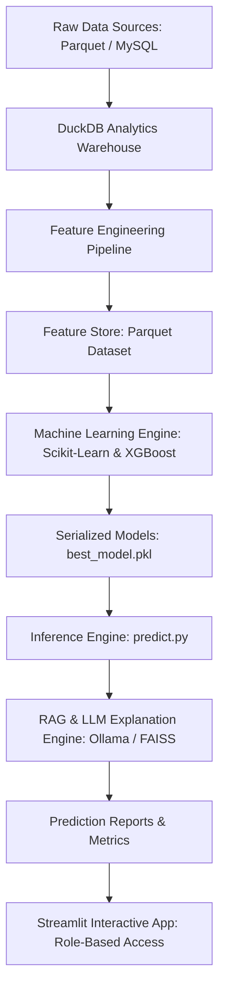

# Workforce Performance Intelligence Platform
## Complete Technical Architecture & Code Walkthrough Tutorial

---

## 1. System Overview & Architecture

The **Workforce Performance Intelligence Platform** is an enterprise-grade AI and Machine Learning system designed to predict employee performance scores, quantify organizational health, enforce granular role-based access security, and generate explainable AI insights powered by Retrieval-Augmented Generation (RAG).



### Core Technologies
- **Data Engineering**: DuckDB, Pandas, Parquet, PyMySQL, SQLAlchemy
- **Machine Learning**: Scikit-Learn (Ridge, Lasso, ElasticNet, Decision Trees, Random Forest), XGBoost, Joblib
- **AI & RAG**: LangChain, FAISS Vector Store, Ollama (`phi3:latest`), `nomic-embed-text`
- **Security**: Passwords Hashing (Bcrypt), RBAC Security Matrix, Session Management
- **UI & Visualization**: Streamlit, Plotly Express

---

## 2. Platform Configuration & Environment Setup

### `src/config/settings.py`
Defines project-wide constants, filesystem paths, LLM provider endpoints, and default inference hyperparameters.

```python
from pathlib import Path

# ======================================================
# Project Paths
# ======================================================
PROJECT_ROOT = Path(__file__).resolve().parents[2]

DATA_PATH = (
    PROJECT_ROOT / "data" / "processed" / "employee_analytics_dataset.parquet"
)
MODEL_PATH = (
    PROJECT_ROOT / "models" / "best_model.pkl"
)
OUTPUT_PATH = (
    PROJECT_ROOT / "output" / "prediction_output.csv"
)
KNOWLEDGE_BASE_PATH = (
    PROJECT_ROOT / "knowledge_base"
)

# ======================================================
# Ollama & AI Configurations
# ======================================================
OLLAMA_HOST = "http://localhost:11434"
OLLAMA_MODEL = "phi3:latest"
EMBEDDING_MODEL = "nomic-embed-text"
TEMPERATURE = 0.2
MAX_SUMMARY_TOKENS = 300
```

---

## 3. Security & Governance Layer (`src/security/`)

The platform implements an enterprise security layer that guarantees privacy across sensitive HR data.

### Security Matrix
| Role | Accessible Scope | Features Permitted |
| :--- | :--- | :--- |
| **Admin** | Entire Organization | Schema Validation, Platform Administration, Dev Dashboard, Analytics, Predictions |
| **Leadership** | Entire Organization | Executive Analytics, Org Predictions, Department Trends |
| **HR** | Entire Organization | Leave Usage, Attendance Tracking, Employee Directory, Predictions |
| **Manager** | Direct Reportees Only | Team Performance Predictions, Reporting Hierarchy |

### `src/security/auth.py`
Handles credential verification and role verification against database records.

```python
from sqlalchemy import text
from src.database.mysql_connection import get_engine
from src.security.role_manager import get_employee_role

def authenticate_user(employee_id, first_name, last_name, selected_role, password):
    if selected_role == "Admin":
        if password != "admin4321":
            return None
    else:
        if password != "admin1234":
            return None

    engine = get_engine()
    query = text("""
        SELECT employee_id, first_name, last_name
        FROM employee
        WHERE employee_id = :employee_id
    """)

    with engine.connect() as conn:
        result = conn.execute(query, {"employee_id": employee_id})
        employee = result.fetchone()

    if not employee:
        return None

    if employee.first_name.strip().lower() != first_name.strip().lower():
        return None
    if employee.last_name.strip().lower() != last_name.strip().lower():
        return None

    actual_role = get_employee_role(employee_id)
    if actual_role != selected_role:
        return None

    return {
        "employee_id": employee.employee_id,
        "first_name": employee.first_name,
        "last_name": employee.last_name,
        "role": actual_role
    }
```

### `src/security/data_access.py`
Enforces row-level security ensuring managers only view predictions and analytics for employees within their reporting structure.

```python
from sqlalchemy import text
from src.database.mysql_connection import get_engine

def get_manager_reportees(manager_id: int):
    engine = get_engine()
    query = text("""
        SELECT employee_id
        FROM employee_reporting
        WHERE reporting_manager_id = :manager_id
          AND reporting_status = 'Active'
    """)
    with engine.connect() as conn:
        result = conn.execute(query, {"manager_id": manager_id})
        return [row.employee_id for row in result.fetchall()]

def get_all_employee_ids():
    engine = get_engine()
    query = text("SELECT employee_id FROM employee")
    with engine.connect() as conn:
        result = conn.execute(query)
        return [row.employee_id for row in result.fetchall()]

def get_accessible_employee_ids(employee_id: int, role: str):
    if role in ["Admin", "Leadership", "HR"]:
        return get_all_employee_ids()
    if role == "Manager":
        return get_manager_reportees(employee_id)
    return []
```

---

## 4. Feature Engineering Suite (`src/features/`)

Feature engineering transforms raw employee logs into numerical predictors.

### `src/features/attendance_features.py`
Computes attendance stability metrics.

```python
import pandas as pd

def calculate_attendance_metrics(attendance_df: pd.DataFrame) -> pd.DataFrame:
    grouped = attendance_df.groupby("employee_id")
    metrics = grouped.agg(
        total_days=("attendance_status", "count"),
        days_present=("attendance_status", lambda x: (x == "Present").sum()),
        days_absent=("attendance_status", lambda x: (x == "Absent").sum()),
        days_late=("attendance_status", lambda x: (x == "Late").sum()),
        total_overtime_hours=("overtime_hours", "sum"),
    ).reset_index()

    metrics["attendance_rate"] = (metrics["days_present"] / metrics["total_days"]) * 100
    metrics["lateness_rate"] = (metrics["days_late"] / metrics["total_days"]) * 100
    return metrics
```

### `src/features/performance_features.py`
Calculates historical rating metrics.

```python
import pandas as pd

def calculate_performance_history(performance_df: pd.DataFrame) -> pd.DataFrame:
    summary = performance_df.groupby("employee_id").agg(
        avg_performance_score=("rating", "mean"),
        max_performance_score=("rating", "max"),
        min_performance_score=("rating", "min"),
        total_reviews=("rating", "count"),
    ).reset_index()
    return summary
```

---

## 5. Machine Learning Pipeline (`src/models/` & `src/training/`)

### `src/models/regression_models.py`
Initializes regression algorithms for model competition.

```python
from sklearn.linear_model import LinearRegression, Ridge, Lasso, ElasticNet
from sklearn.tree import DecisionTreeRegressor
from sklearn.ensemble import RandomForestRegressor
from xgboost import XGBRegressor

def get_regression_models():
    return {
        "Linear Regression": LinearRegression(),
        "Ridge Regression": Ridge(alpha=1.0, random_state=42),
        "Lasso Regression": Lasso(alpha=0.01, random_state=42, max_iter=10000),
        "ElasticNet Regression": ElasticNet(alpha=0.01, l1_ratio=0.5, random_state=42, max_iter=10000),
        "Decision Tree": DecisionTreeRegressor(random_state=42, max_depth=5),
        "Random Forest": RandomForestRegressor(n_estimators=100, random_state=42, max_depth=8),
        "XGBoost": XGBRegressor(n_estimators=100, learning_rate=0.05, max_depth=4, random_state=42, objective="reg:squarederror"),
    }
```

### `src/training/train_models.py`
Pipeline execution, 5-fold cross-validation, hyperparameter evaluation, and saving best model artifacts.

```python
import joblib
import pandas as pd
from sklearn.compose import ColumnTransformer
from sklearn.model_selection import cross_val_score, train_test_split
from sklearn.pipeline import Pipeline
from sklearn.preprocessing import OneHotEncoder, StandardScaler
from src.models.regression_models import get_regression_models
from src.evaluation.model_metrics import calculate_regression_metrics

def train_and_evaluate_models():
    df = pd.read_parquet("data/processed/employee_analytics_dataset.parquet")
    df = df[df["avg_performance_score"] > 0].copy()

    y = df["avg_performance_score"]
    X = df.drop(columns=["employee_id", "first_name", "last_name", "avg_performance_score"], errors="ignore")

    num_cols = X.select_dtypes(include=["int64", "float64", "bool"]).columns.tolist()
    cat_cols = X.select_dtypes(include=["object", "category"]).columns.tolist()

    preprocessor = ColumnTransformer(
        transformers=[
            ("numeric", StandardScaler(), num_cols),
            ("categorical", OneHotEncoder(handle_unknown="ignore"), cat_cols),
        ]
    )

    X_train, X_test, y_train, y_test = train_test_split(X, y, test_size=0.2, random_state=42)

    results = []
    models = get_regression_models()

    for name, model in models.items():
        pipeline = Pipeline([("preprocessor", preprocessor), ("model", model)])
        pipeline.fit(X_train, y_train)

        test_pred = pipeline.predict(X_test)
        metrics = calculate_regression_metrics(y_train, pipeline.predict(X_train), y_test, test_pred)

        cv_scores = cross_val_score(pipeline, X, y, cv=5, scoring="neg_root_mean_squared_error")
        cv_rmse = -cv_scores.mean()

        results.append({"model_name": name, "cv_rmse": cv_rmse, **metrics})

    results_df = pd.DataFrame(results).sort_values(by="test_rmse")
    results_df.to_csv("reports/model_comparison.csv", index=False)
```

---

## 6. AI & Retrieval-Augmented Generation (`src/ai/`)

### RAG Architecture
```
[User Context & Query] ---> [Vector Store: FAISS] ---> [Context Retrieval]
                                                             |
                                                             v
[LLM: Ollama phi3] <--- [Prompt Template + Context] <---------
```

### `src/ai/rag/rag_service.py`
Retrieves policy guidelines to substantiate recommendations.

```python
from src.ai.rag.vector_store import VectorStore

class RAGService:
    def __init__(self):
        self.vector_db = VectorStore().build()

    def retrieve_context(self, query: str, k: int = 3):
        docs = self.vector_db.similarity_search(query, k=k)
        return "\n\n".join([doc.page_content for doc in docs])
```

---

## 7. Streamlit Interactive Application (`app/`)

### `app/main.py`
Handles login gating, role selection, and user workspace setup.

```python
import streamlit as st
from src.security.session_manager import initialize_session, login_user, logout_user
from src.security.auth import authenticate_user

initialize_session()

st.set_page_config(page_title="Workforce Intelligence", page_icon="📊", layout="wide")

if not st.session_state.authenticated:
    st.title("Workforce Performance Intelligence Platform")
    employee_id = st.number_input("Employee ID", min_value=1, step=1)
    first_name = st.text_input("First Name")
    last_name = st.text_input("Last Name")
    role = st.selectbox("Role", ["Admin", "Leadership", "HR", "Manager"])
    password = st.text_input("Password", type="password")

    if st.button("Login"):
        user = authenticate_user(employee_id, first_name, last_name, role, password)
        if user:
            login_user(user)
            st.rerun()
        else:
            st.error("Invalid credentials.")
    st.stop()
```

---

## 8. Summary & Deployment Instructions

1. **Initialize Warehouse**:
   ```bash
   python src/pipeline/create_duckdb_warehouse.py
   ```
2. **Train Models**:
   ```bash
   python src/training/train_models.py
   ```
3. **Generate Predictions**:
   ```bash
   python src/inference/predict.py
   ```
4. **Launch Application**:
   ```bash
   streamlit run app/main.py
   ```
