# Workforce Performance Prediction System — All Mermaid Diagrams

---

## Stage 1 — Foundation, Data Acquisition & Governance Layer

### 1.1 Flow Diagram

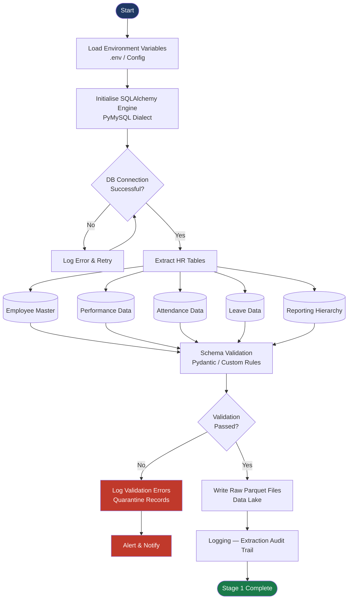
```mermaid
flowchart TD
    A([Start]) --> B[Load Environment Variables\n.env / Config]
    B --> C[Initialise SQLAlchemy Engine\nPyMySQL Dialect]
    C --> D{DB Connection\nSuccessful?}
    D -- No --> E[Log Error & Retry]
    E --> D
    D -- Yes --> F[Extract HR Tables]

    F --> F1[(Employee Master)]
    F --> F2[(Performance Data)]
    F --> F3[(Attendance Data)]
    F --> F4[(Leave Data)]
    F --> F5[(Reporting Hierarchy)]

    F1 & F2 & F3 & F4 & F5 --> G[Schema Validation\nPydantic / Custom Rules]
    G --> H{Validation\nPassed?}
    H -- No --> I[Log Validation Errors\nQuarantine Records]
    I --> J[Alert & Notify]
    H -- Yes --> K[Write Raw Parquet Files\nData Lake]
    K --> L[Logging — Extraction Audit Trail]
    L --> M([Stage 1 Complete])

    style A fill:#1F3864,color:#fff
    style M fill:#1A7A4A,color:#fff
    style I fill:#c0392b,color:#fff
    style J fill:#c0392b,color:#fff
```

---

### 1.2 Sequence Diagram

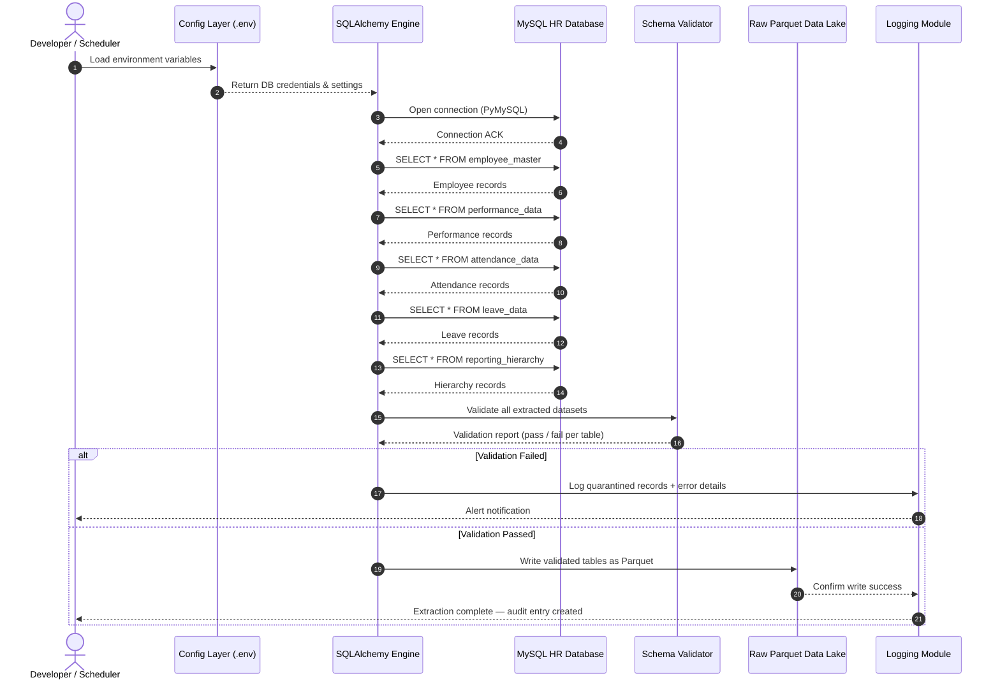
```mermaid
sequenceDiagram
    autonumber
    actor Dev as Developer / Scheduler
    participant Cfg as Config Layer (.env)
    participant SA  as SQLAlchemy Engine
    participant DB  as MySQL HR Database
    participant Val as Schema Validator
    participant Lake as Raw Parquet Data Lake
    participant Log as Logging Module

    Dev->>Cfg: Load environment variables
    Cfg-->>SA: Return DB credentials & settings
    SA->>DB: Open connection (PyMySQL)
    DB-->>SA: Connection ACK

    SA->>DB: SELECT * FROM employee_master
    DB-->>SA: Employee records

    SA->>DB: SELECT * FROM performance_data
    DB-->>SA: Performance records

    SA->>DB: SELECT * FROM attendance_data
    DB-->>SA: Attendance records

    SA->>DB: SELECT * FROM leave_data
    DB-->>SA: Leave records

    SA->>DB: SELECT * FROM reporting_hierarchy
    DB-->>SA: Hierarchy records

    SA->>Val: Validate all extracted datasets
    Val-->>SA: Validation report (pass / fail per table)

    alt Validation Failed
        SA->>Log: Log quarantined records + error details
        Log-->>Dev: Alert notification
    else Validation Passed
        SA->>Lake: Write validated tables as Parquet
        Lake-->>Log: Confirm write success
        Log-->>Dev: Extraction complete — audit entry created
    end
```

---

### 1.3 ER Diagram

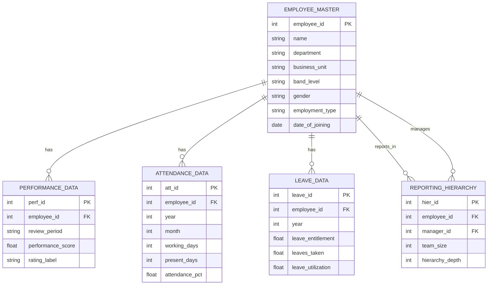
```mermaid
erDiagram
    EMPLOYEE_MASTER {
        int    employee_id PK
        string name
        string department
        string business_unit
        string band_level
        string gender
        string employment_type
        date   date_of_joining
    }

    PERFORMANCE_DATA {
        int    perf_id       PK
        int    employee_id   FK
        string review_period
        float  performance_score
        string rating_label
    }

    ATTENDANCE_DATA {
        int  att_id       PK
        int  employee_id  FK
        int  year
        int  month
        int  working_days
        int  present_days
        float attendance_pct
    }

    LEAVE_DATA {
        int   leave_id     PK
        int   employee_id  FK
        int   year
        float leave_entitlement
        float leaves_taken
        float leave_utilization
    }

    REPORTING_HIERARCHY {
        int  hier_id      PK
        int  employee_id  FK
        int  manager_id   FK
        int  team_size
        int  hierarchy_depth
    }

    EMPLOYEE_MASTER ||--o{ PERFORMANCE_DATA   : "has"
    EMPLOYEE_MASTER ||--o{ ATTENDANCE_DATA    : "has"
    EMPLOYEE_MASTER ||--o{ LEAVE_DATA         : "has"
    EMPLOYEE_MASTER ||--o{ REPORTING_HIERARCHY: "reports_in"
    EMPLOYEE_MASTER ||--o{ REPORTING_HIERARCHY: "manages"
```

---
---

## Stage 2 — Data Engineering, Analytics & Feature Intelligence Layer

### 2.1 Flow Diagram

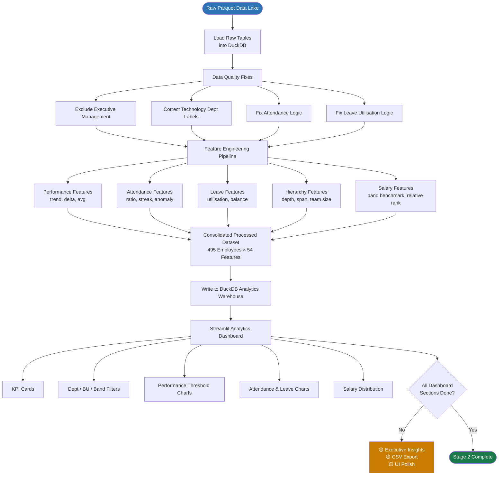
```mermaid
flowchart TD
    A([Raw Parquet Data Lake]) --> B[Load Raw Tables\ninto DuckDB]
    B --> C[Data Quality Fixes]
    C --> C1[Exclude Executive Management]
    C --> C2[Correct Technology Dept Labels]
    C --> C3[Fix Attendance Logic]
    C --> C4[Fix Leave Utilisation Logic]

    C1 & C2 & C3 & C4 --> D[Feature Engineering Pipeline]

    D --> D1[Performance Features\ntrend, delta, avg]
    D --> D2[Attendance Features\nratio, streak, anomaly]
    D --> D3[Leave Features\nutilisation, balance]
    D --> D4[Hierarchy Features\ndepth, span, team size]
    D --> D5[Salary Features\nband benchmark, relative rank]

    D1 & D2 & D3 & D4 & D5 --> E[Consolidated Processed Dataset\n495 Employees × 54 Features]
    E --> F[Write to DuckDB Analytics Warehouse]
    F --> G[Streamlit Analytics Dashboard]

    G --> G1[KPI Cards]
    G --> G2[Dept / BU / Band Filters]
    G --> G3[Performance Threshold Charts]
    G --> G4[Attendance & Leave Charts]
    G --> G5[Salary Distribution]

    G --> H{All Dashboard\nSections Done?}
    H -- No --> I[🟡 Executive Insights\n🟡 CSV Export\n🟡 UI Polish]
    H -- Yes --> J([Stage 2 Complete])

    style A fill:#2E75B6,color:#fff
    style J fill:#1A7A4A,color:#fff
    style I fill:#C87D00,color:#fff
```

---

### 2.2 Sequence Diagram

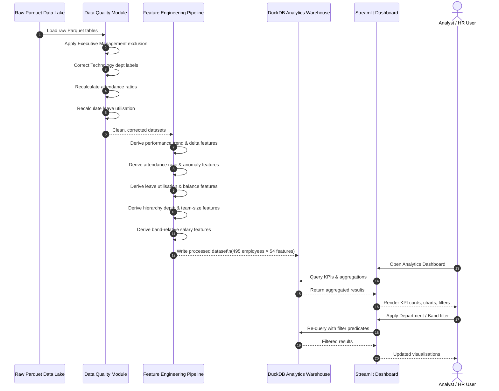
```mermaid
sequenceDiagram
    autonumber
    participant Lake  as Raw Parquet Data Lake
    participant DQ    as Data Quality Module
    participant FE    as Feature Engineering Pipeline
    participant DW    as DuckDB Analytics Warehouse
    participant Dash  as Streamlit Dashboard
    actor User as Analyst / HR User

    Lake->>DQ: Load raw Parquet tables
    DQ->>DQ: Apply Executive Management exclusion
    DQ->>DQ: Correct Technology dept labels
    DQ->>DQ: Recalculate attendance ratios
    DQ->>DQ: Recalculate leave utilisation
    DQ-->>FE: Clean, corrected datasets

    FE->>FE: Derive performance trend & delta features
    FE->>FE: Derive attendance ratio & anomaly features
    FE->>FE: Derive leave utilisation & balance features
    FE->>FE: Derive hierarchy depth & team-size features
    FE->>FE: Derive band-relative salary features
    FE-->>DW: Write processed dataset\n(495 employees × 54 features)

    User->>Dash: Open Analytics Dashboard
    Dash->>DW: Query KPIs & aggregations
    DW-->>Dash: Return aggregated results
    Dash-->>User: Render KPI cards, charts, filters

    User->>Dash: Apply Department / Band filter
    Dash->>DW: Re-query with filter predicates
    DW-->>Dash: Filtered results
    Dash-->>User: Updated visualisations
```

---

### 2.3 ER Diagram

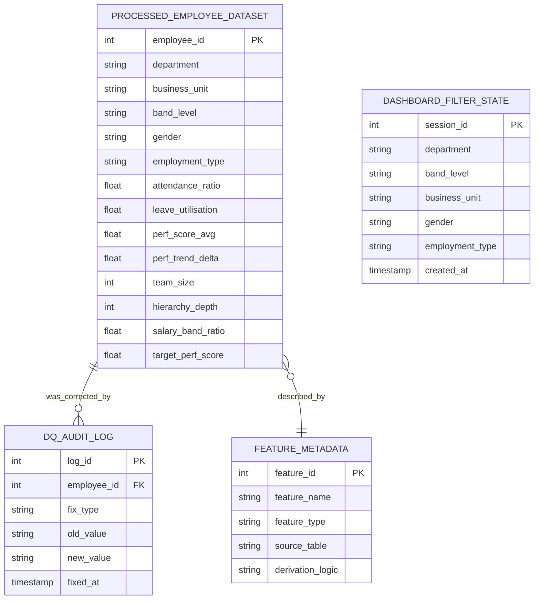
```mermaid
erDiagram
    PROCESSED_EMPLOYEE_DATASET {
        int    employee_id       PK
        string department
        string business_unit
        string band_level
        string gender
        string employment_type
        float  attendance_ratio
        float  leave_utilisation
        float  perf_score_avg
        float  perf_trend_delta
        int    team_size
        int    hierarchy_depth
        float  salary_band_ratio
        float  target_perf_score
    }

    FEATURE_METADATA {
        int    feature_id   PK
        string feature_name
        string feature_type
        string source_table
        string derivation_logic
    }

    DASHBOARD_FILTER_STATE {
        int    session_id  PK
        string department
        string band_level
        string business_unit
        string gender
        string employment_type
        timestamp created_at
    }

    DQ_AUDIT_LOG {
        int    log_id       PK
        int    employee_id  FK
        string fix_type
        string old_value
        string new_value
        timestamp fixed_at
    }

    PROCESSED_EMPLOYEE_DATASET ||--o{ DQ_AUDIT_LOG      : "was_corrected_by"
    PROCESSED_EMPLOYEE_DATASET }o--|| FEATURE_METADATA  : "described_by"
```

---
---

## Stage 3 — Predictive Intelligence Layer

### 3.1 Flow Diagram

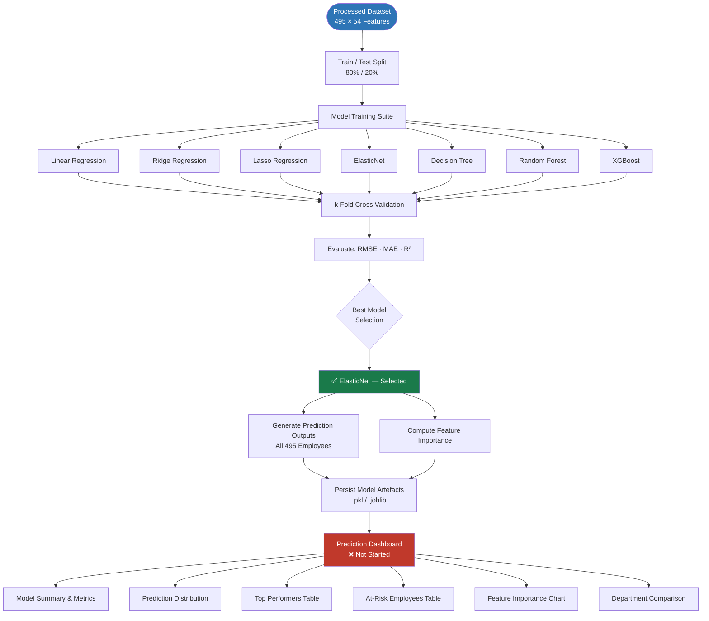
```mermaid
flowchart TD
    A([Processed Dataset\n495 × 54 Features]) --> B[Train / Test Split\n80% / 20%]
    B --> C[Model Training Suite]

    C --> C1[Linear Regression]
    C --> C2[Ridge Regression]
    C --> C3[Lasso Regression]
    C --> C4[ElasticNet]
    C --> C5[Decision Tree]
    C --> C6[Random Forest]
    C --> C7[XGBoost]

    C1 & C2 & C3 & C4 & C5 & C6 & C7 --> D[k-Fold Cross Validation]
    D --> E[Evaluate: RMSE · MAE · R²]
    E --> F{Best Model\nSelection}
    F --> G[✅ ElasticNet — Selected]

    G --> H[Generate Prediction Outputs\nAll 495 Employees]
    G --> I[Compute Feature Importance]
    H & I --> J[Persist Model Artefacts\n.pkl / .joblib]

    J --> K[Prediction Dashboard\n❌ Not Started]
    K --> K1[Model Summary & Metrics]
    K --> K2[Prediction Distribution]
    K --> K3[Top Performers Table]
    K --> K4[At-Risk Employees Table]
    K --> K5[Feature Importance Chart]
    K --> K6[Department Comparison]

    style A fill:#2E75B6,color:#fff
    style G fill:#1A7A4A,color:#fff
    style K fill:#c0392b,color:#fff
```

---

### 3.2 Sequence Diagram

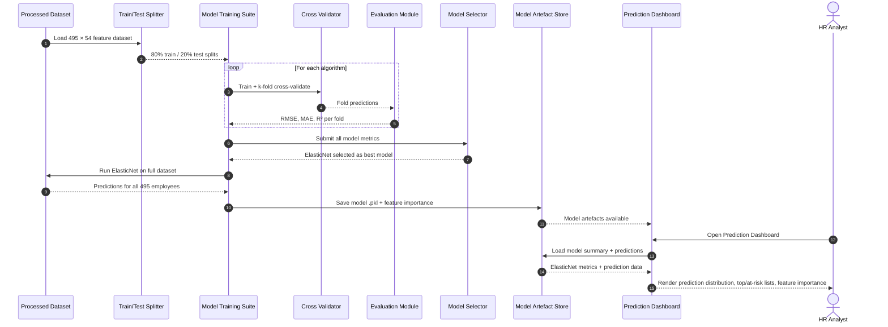
```mermaid
sequenceDiagram
    autonumber
    participant DS   as Processed Dataset
    participant Split as Train/Test Splitter
    participant Trainer as Model Training Suite
    participant CV    as Cross Validator
    participant Eval  as Evaluation Module
    participant Sel   as Model Selector
    participant Store as Model Artefact Store
    participant Dash  as Prediction Dashboard
    actor User as HR Analyst

    DS->>Split: Load 495 × 54 feature dataset
    Split-->>Trainer: 80% train / 20% test splits

    loop For each algorithm
        Trainer->>CV: Train + k-fold cross-validate
        CV-->>Eval: Fold predictions
        Eval-->>Trainer: RMSE, MAE, R² per fold
    end

    Trainer->>Sel: Submit all model metrics
    Sel-->>Trainer: ElasticNet selected as best model

    Trainer->>DS: Run ElasticNet on full dataset
    DS-->>Trainer: Predictions for all 495 employees

    Trainer->>Store: Save model .pkl + feature importance
    Store-->>Dash: Model artefacts available

    User->>Dash: Open Prediction Dashboard
    Dash->>Store: Load model summary + predictions
    Store-->>Dash: ElasticNet metrics + prediction data
    Dash-->>User: Render prediction distribution, top/at-risk lists, feature importance
```

---

### 3.3 ER Diagram

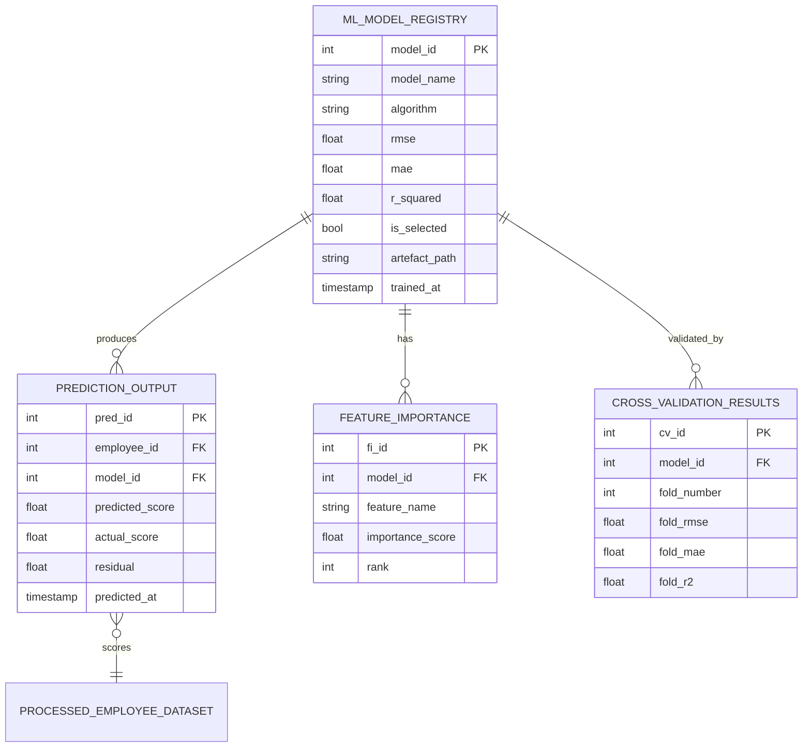
```mermaid
erDiagram
    ML_MODEL_REGISTRY {
        int    model_id     PK
        string model_name
        string algorithm
        float  rmse
        float  mae
        float  r_squared
        bool   is_selected
        string artefact_path
        timestamp trained_at
    }

    PREDICTION_OUTPUT {
        int    pred_id        PK
        int    employee_id    FK
        int    model_id       FK
        float  predicted_score
        float  actual_score
        float  residual
        timestamp predicted_at
    }

    FEATURE_IMPORTANCE {
        int    fi_id       PK
        int    model_id    FK
        string feature_name
        float  importance_score
        int    rank
    }

    CROSS_VALIDATION_RESULTS {
        int   cv_id      PK
        int   model_id   FK
        int   fold_number
        float fold_rmse
        float fold_mae
        float fold_r2
    }

    ML_MODEL_REGISTRY    ||--o{ PREDICTION_OUTPUT        : "produces"
    ML_MODEL_REGISTRY    ||--o{ FEATURE_IMPORTANCE       : "has"
    ML_MODEL_REGISTRY    ||--o{ CROSS_VALIDATION_RESULTS : "validated_by"
    PREDICTION_OUTPUT    }o--|| PROCESSED_EMPLOYEE_DATASET: "scores"
```

---
---

## Security & Application Layer

### 4.1 Flow Diagram

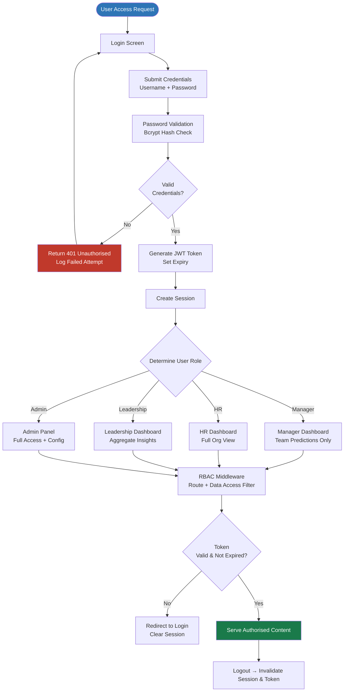
```mermaid
flowchart TD
    A([User Access Request]) --> B[Login Screen]
    B --> C[Submit Credentials\nUsername + Password]
    C --> D[Password Validation\nBcrypt Hash Check]
    D --> H{Valid\nCredentials?}
    H -- No --> I[Return 401 Unauthorised\nLog Failed Attempt]
    I --> B
    H -- Yes --> J[Generate JWT Token\nSet Expiry]
    J --> K[Create Session]
    K --> L{Determine User Role}

    L -- Manager --> M1[Manager Dashboard\nTeam Predictions Only]
    L -- HR --> M2[HR Dashboard\nFull Org View]
    L -- Leadership --> M3[Leadership Dashboard\nAggregate Insights]
    L -- Admin --> M4[Admin Panel\nFull Access + Config]

    M1 & M2 & M3 & M4 --> N[RBAC Middleware\nRoute + Data Access Filter]
    N --> O{Token\nValid & Not Expired?}
    O -- No --> P[Redirect to Login\nClear Session]
    O -- Yes --> Q[Serve Authorised Content]
    Q --> R[Logout → Invalidate Session & Token]

    style A fill:#2E75B6,color:#fff
    style I fill:#c0392b,color:#fff
    style Q fill:#1A7A4A,color:#fff
```

---

### 4.2 Sequence Diagram

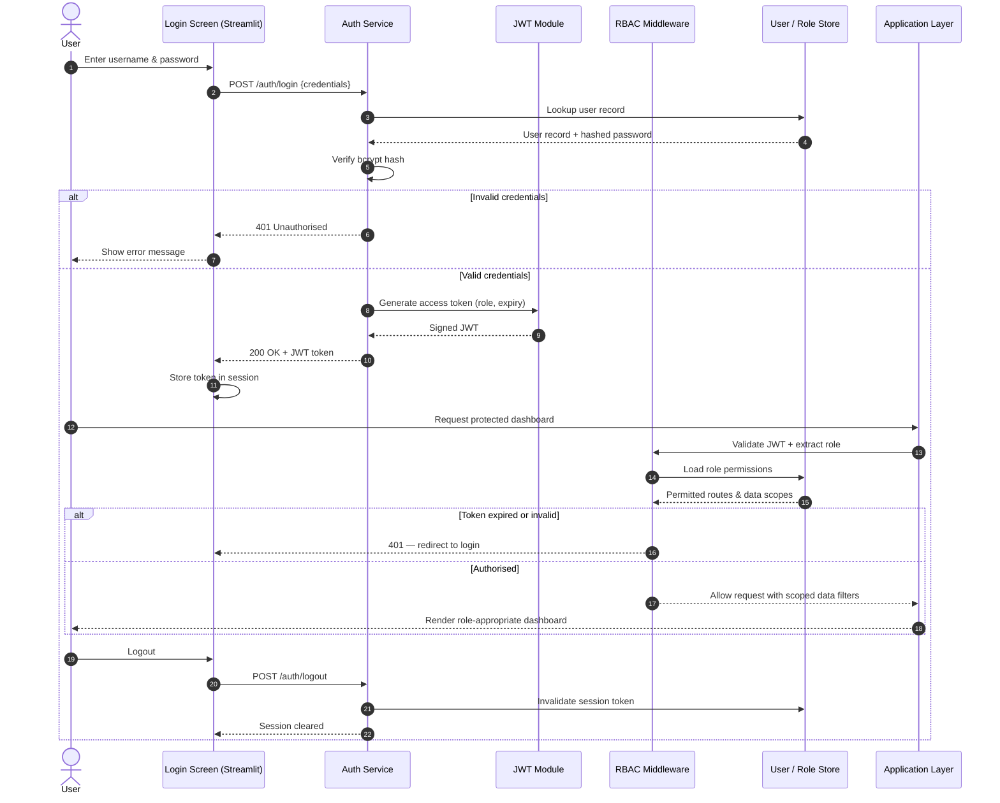
```mermaid
sequenceDiagram
    autonumber
    actor User
    participant UI   as Login Screen (Streamlit)
    participant Auth as Auth Service
    participant JWT  as JWT Module
    participant RBAC as RBAC Middleware
    participant DB   as User / Role Store
    participant App  as Application Layer

    User->>UI: Enter username & password
    UI->>Auth: POST /auth/login {credentials}
    Auth->>DB: Lookup user record
    DB-->>Auth: User record + hashed password

    Auth->>Auth: Verify bcrypt hash
    alt Invalid credentials
        Auth-->>UI: 401 Unauthorised
        UI-->>User: Show error message
    else Valid credentials
        Auth->>JWT: Generate access token (role, expiry)
        JWT-->>Auth: Signed JWT
        Auth-->>UI: 200 OK + JWT token
        UI->>UI: Store token in session

        User->>App: Request protected dashboard
        App->>RBAC: Validate JWT + extract role
        RBAC->>DB: Load role permissions
        DB-->>RBAC: Permitted routes & data scopes

        alt Token expired or invalid
            RBAC-->>UI: 401 — redirect to login
        else Authorised
            RBAC-->>App: Allow request with scoped data filters
            App-->>User: Render role-appropriate dashboard
        end

        User->>UI: Logout
        UI->>Auth: POST /auth/logout
        Auth->>DB: Invalidate session token
        Auth-->>UI: Session cleared
    end
```

---

### 4.3 ER Diagram

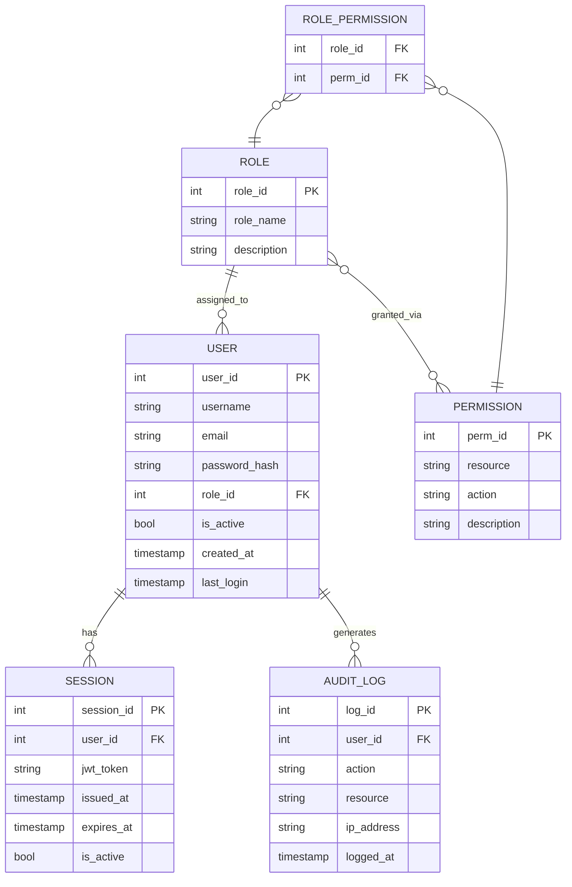
```mermaid
erDiagram
    USER {
        int    user_id    PK
        string username
        string email
        string password_hash
        int    role_id    FK
        bool   is_active
        timestamp created_at
        timestamp last_login
    }

    ROLE {
        int    role_id   PK
        string role_name
        string description
    }

    PERMISSION {
        int    perm_id    PK
        string resource
        string action
        string description
    }

    ROLE_PERMISSION {
        int role_id   FK
        int perm_id   FK
    }

    SESSION {
        int    session_id  PK
        int    user_id     FK
        string jwt_token
        timestamp issued_at
        timestamp expires_at
        bool   is_active
    }

    AUDIT_LOG {
        int    log_id    PK
        int    user_id   FK
        string action
        string resource
        string ip_address
        timestamp logged_at
    }

    ROLE         ||--o{ USER            : "assigned_to"
    ROLE         }o--o{ PERMISSION      : "granted_via"
    ROLE_PERMISSION }o--|| ROLE         : ""
    ROLE_PERMISSION }o--|| PERMISSION   : ""
    USER         ||--o{ SESSION         : "has"
    USER         ||--o{ AUDIT_LOG       : "generates"
```

---
---

## API Layer (FastAPI)

### 5.1 Flow Diagram

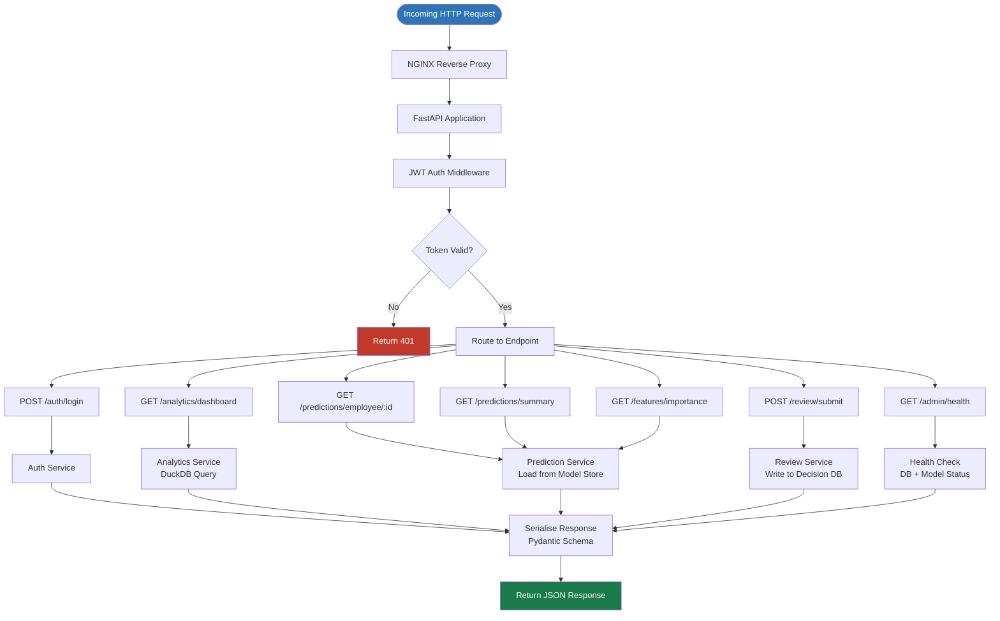
```mermaid
flowchart TD
    A([Incoming HTTP Request]) --> B[NGINX Reverse Proxy]
    B --> C[FastAPI Application]
    C --> D[JWT Auth Middleware]
    D --> E{Token Valid?}
    E -- No --> F[Return 401]
    E -- Yes --> G[Route to Endpoint]

    G --> G1[POST /auth/login]
    G --> G2[GET /analytics/dashboard]
    G --> G3[GET /predictions/employee/:id]
    G --> G4[GET /predictions/summary]
    G --> G5[GET /features/importance]
    G --> G6[POST /review/submit]
    G --> G7[GET /admin/health]

    G1 --> H1[Auth Service]
    G2 --> H2[Analytics Service\nDuckDB Query]
    G3 --> H3[Prediction Service\nLoad from Model Store]
    G4 --> H3
    G5 --> H3
    G6 --> H4[Review Service\nWrite to Decision DB]
    G7 --> H5[Health Check\nDB + Model Status]

    H1 & H2 & H3 & H4 & H5 --> I[Serialise Response\nPydantic Schema]
    I --> J[Return JSON Response]

    style A fill:#2E75B6,color:#fff
    style F fill:#c0392b,color:#fff
    style J fill:#1A7A4A,color:#fff
```

---

### 5.2 Sequence Diagram

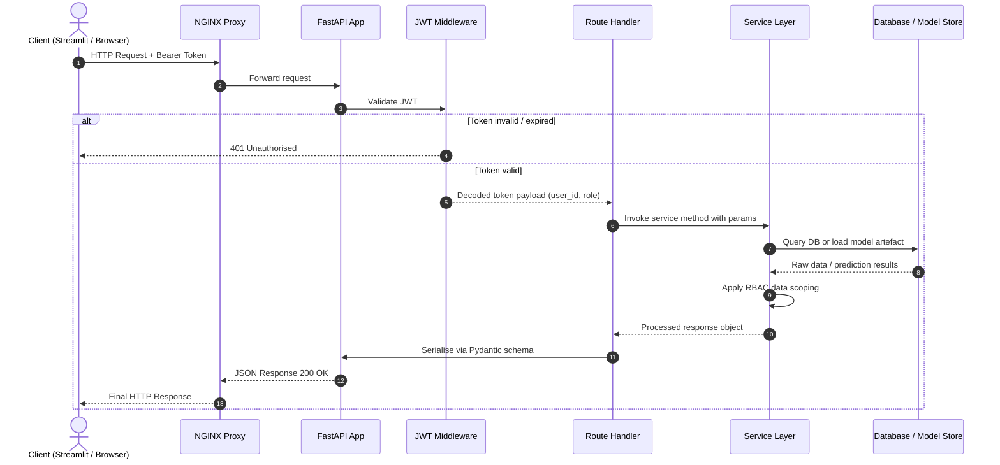
```mermaid
sequenceDiagram
    autonumber
    actor Client as Client (Streamlit / Browser)
    participant NGINX as NGINX Proxy
    participant API   as FastAPI App
    participant MW    as JWT Middleware
    participant Router as Route Handler
    participant Svc   as Service Layer
    participant DB    as Database / Model Store

    Client->>NGINX: HTTP Request + Bearer Token
    NGINX->>API: Forward request

    API->>MW: Validate JWT
    alt Token invalid / expired
        MW-->>Client: 401 Unauthorised
    else Token valid
        MW-->>Router: Decoded token payload (user_id, role)

        Router->>Svc: Invoke service method with params
        Svc->>DB: Query DB or load model artefact
        DB-->>Svc: Raw data / prediction results

        Svc->>Svc: Apply RBAC data scoping
        Svc-->>Router: Processed response object
        Router->>API: Serialise via Pydantic schema
        API-->>NGINX: JSON Response 200 OK
        NGINX-->>Client: Final HTTP Response
    end
```

---
---

## Reverse Proxy Layer (NGINX)

### 6.1 Flow Diagram

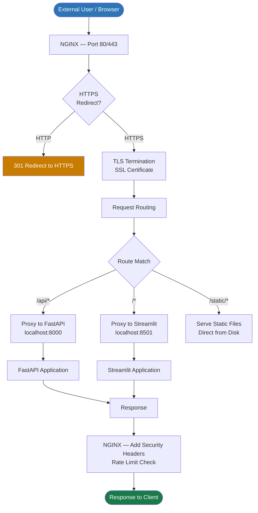
```mermaid
flowchart TD
    A([External User / Browser]) --> B[NGINX — Port 80/443]
    B --> C{HTTPS\nRedirect?}
    C -- HTTP --> D[301 Redirect to HTTPS]
    C -- HTTPS --> E[TLS Termination\nSSL Certificate]

    E --> F[Request Routing]
    F --> F1{Route Match}
    F1 -- /api/* --> G[Proxy to FastAPI\nlocalhost:8000]
    F1 -- /* --> H[Proxy to Streamlit\nlocalhost:8501]
    F1 -- /static/* --> I[Serve Static Files\nDirect from Disk]

    G --> J[FastAPI Application]
    H --> K[Streamlit Application]

    J & K --> L[Response]
    L --> M[NGINX — Add Security Headers\nRate Limit Check]
    M --> N([Response to Client])

    style A fill:#2E75B6,color:#fff
    style D fill:#C87D00,color:#fff
    style N fill:#1A7A4A,color:#fff
```

---

### 6.2 Sequence Diagram

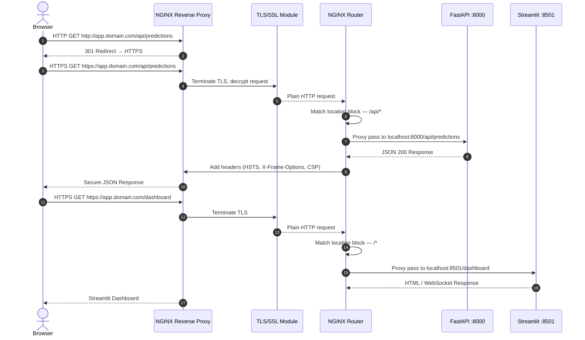
```mermaid
sequenceDiagram
    autonumber
    actor Browser
    participant NGINX  as NGINX Reverse Proxy
    participant TLS    as TLS/SSL Module
    participant Router as NGINX Router
    participant FastAPI as FastAPI :8000
    participant Streamlit as Streamlit :8501

    Browser->>NGINX: HTTP GET http://app.domain.com/api/predictions
    NGINX-->>Browser: 301 Redirect → HTTPS

    Browser->>NGINX: HTTPS GET https://app.domain.com/api/predictions
    NGINX->>TLS: Terminate TLS, decrypt request
    TLS-->>Router: Plain HTTP request

    Router->>Router: Match location block — /api/*
    Router->>FastAPI: Proxy pass to localhost:8000/api/predictions

    FastAPI-->>Router: JSON 200 Response
    Router->>NGINX: Add headers (HSTS, X-Frame-Options, CSP)
    NGINX-->>Browser: Secure JSON Response

    Browser->>NGINX: HTTPS GET https://app.domain.com/dashboard
    NGINX->>TLS: Terminate TLS
    TLS-->>Router: Plain HTTP request
    Router->>Router: Match location block — /*
    Router->>Streamlit: Proxy pass to localhost:8501/dashboard
    Streamlit-->>Router: HTML / WebSocket Response
    NGINX-->>Browser: Streamlit Dashboard
```

---
---

## Stage 4 — Context Engineering & Explainable AI Layer

### 7.1 Flow Diagram

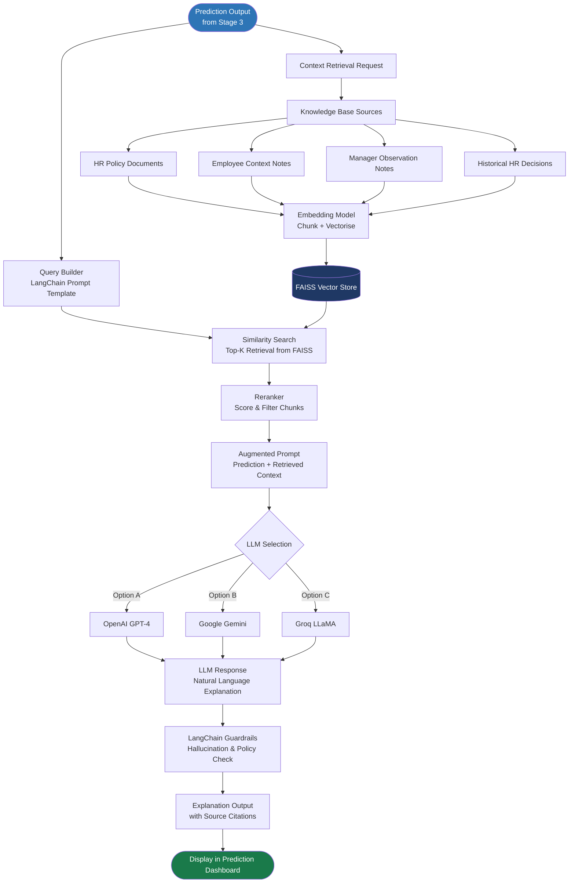
```mermaid
flowchart TD
    A([Prediction Output\nfrom Stage 3]) --> B[Context Retrieval Request]

    B --> C[Knowledge Base Sources]
    C --> C1[HR Policy Documents]
    C --> C2[Employee Context Notes]
    C --> C3[Manager Observation Notes]
    C --> C4[Historical HR Decisions]

    C1 & C2 & C3 & C4 --> D[Embedding Model\nChunk + Vectorise]
    D --> E[(FAISS Vector Store)]

    A --> F[Query Builder\nLangChain Prompt Template]
    F --> G[Similarity Search\nTop-K Retrieval from FAISS]
    E --> G
    G --> H[Reranker\nScore & Filter Chunks]
    H --> I[Augmented Prompt\nPrediction + Retrieved Context]

    I --> J{LLM Selection}
    J -- Option A --> J1[OpenAI GPT-4]
    J -- Option B --> J2[Google Gemini]
    J -- Option C --> J3[Groq LLaMA]

    J1 & J2 & J3 --> K[LLM Response\nNatural Language Explanation]
    K --> L[LangChain Guardrails\nHallucination & Policy Check]
    L --> M[Explanation Output\nwith Source Citations]
    M --> N([Display in Prediction Dashboard])

    style A fill:#2E75B6,color:#fff
    style E fill:#1F3864,color:#fff
    style N fill:#1A7A4A,color:#fff
```

---

### 7.2 Sequence Diagram

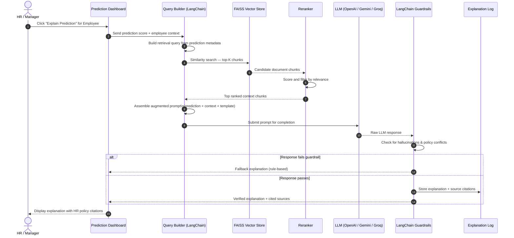
```mermaid
sequenceDiagram
    autonumber
    actor User as HR / Manager
    participant PD   as Prediction Dashboard
    participant QB   as Query Builder (LangChain)
    participant FAISS as FAISS Vector Store
    participant Rerank as Reranker
    participant LLM  as LLM (OpenAI / Gemini / Groq)
    participant Guard as LangChain Guardrails
    participant Log  as Explanation Log

    User->>PD: Click "Explain Prediction" for Employee #42
    PD->>QB: Send prediction score + employee context
    QB->>QB: Build retrieval query from prediction metadata
    QB->>FAISS: Similarity search — top-K chunks
    FAISS-->>Rerank: Candidate document chunks

    Rerank->>Rerank: Score and filter by relevance
    Rerank-->>QB: Top ranked context chunks

    QB->>QB: Assemble augmented prompt\n(prediction + context + template)
    QB->>LLM: Submit prompt for completion
    LLM-->>Guard: Raw LLM response

    Guard->>Guard: Check for hallucinations & policy conflicts
    alt Response fails guardrail
        Guard-->>PD: Fallback explanation (rule-based)
    else Response passes
        Guard->>Log: Store explanation + source citations
        Guard-->>PD: Verified explanation + cited sources
    end

    PD-->>User: Display explanation with HR policy citations
```

---

### 7.3 ER Diagram

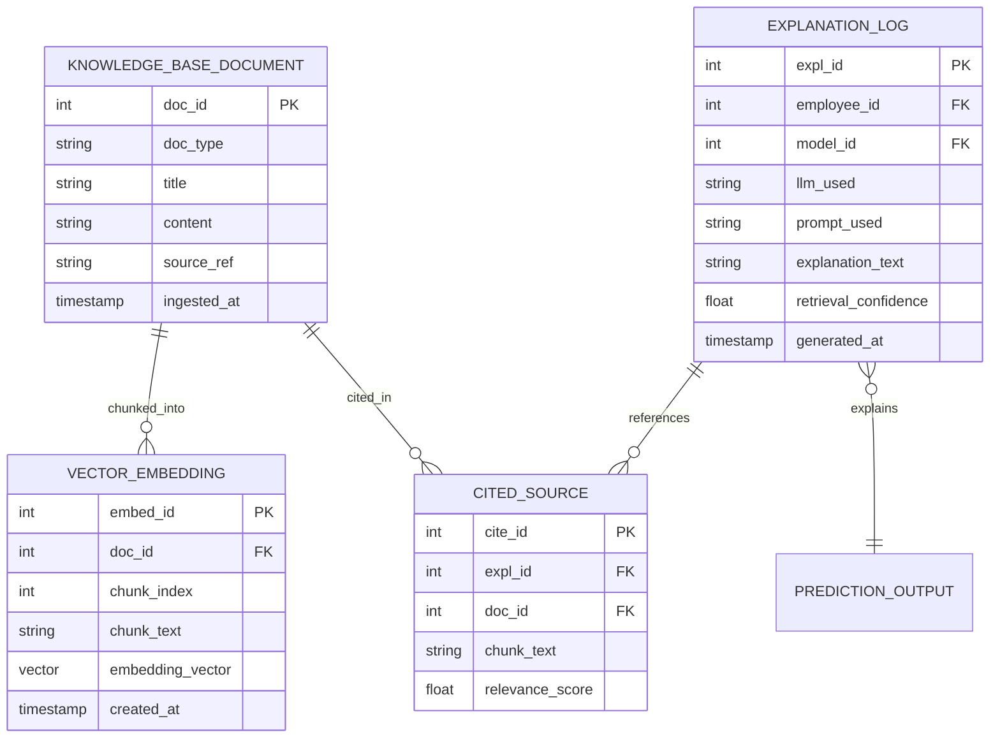
```mermaid
erDiagram
    KNOWLEDGE_BASE_DOCUMENT {
        int    doc_id     PK
        string doc_type
        string title
        string content
        string source_ref
        timestamp ingested_at
    }

    VECTOR_EMBEDDING {
        int    embed_id    PK
        int    doc_id      FK
        int    chunk_index
        string chunk_text
        vector embedding_vector
        timestamp created_at
    }

    EXPLANATION_LOG {
        int    expl_id       PK
        int    employee_id   FK
        int    model_id      FK
        string llm_used
        string prompt_used
        string explanation_text
        float  retrieval_confidence
        timestamp generated_at
    }

    CITED_SOURCE {
        int    cite_id    PK
        int    expl_id    FK
        int    doc_id     FK
        string chunk_text
        float  relevance_score
    }

    KNOWLEDGE_BASE_DOCUMENT ||--o{ VECTOR_EMBEDDING : "chunked_into"
    KNOWLEDGE_BASE_DOCUMENT ||--o{ CITED_SOURCE     : "cited_in"
    EXPLANATION_LOG         ||--o{ CITED_SOURCE     : "references"
    EXPLANATION_LOG         }o--|| PREDICTION_OUTPUT: "explains"
```

---
---

## Stage 5 — Human-in-the-Loop Decision Intelligence Layer

### 8.1 Flow Diagram

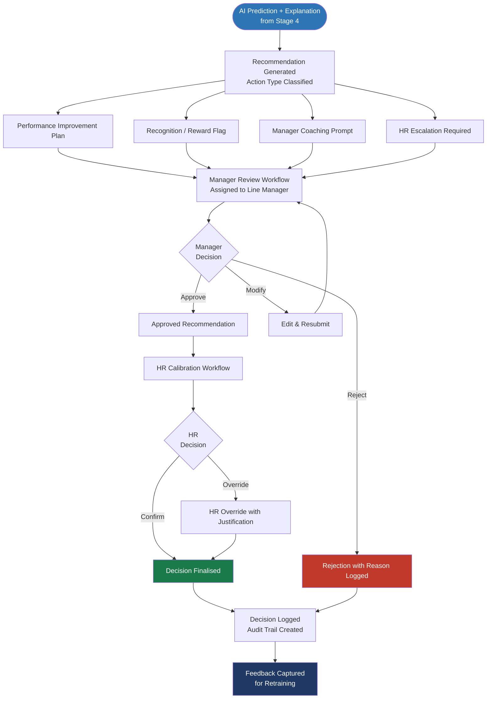
```mermaid
flowchart TD
    A([AI Prediction + Explanation\nfrom Stage 4]) --> B[Recommendation Generated\nAction Type Classified]
    B --> B1[Performance Improvement Plan]
    B --> B2[Recognition / Reward Flag]
    B --> B3[Manager Coaching Prompt]
    B --> B4[HR Escalation Required]

    B1 & B2 & B3 & B4 --> C[Manager Review Workflow\nAssigned to Line Manager]
    C --> D{Manager\nDecision}
    D -- Approve --> E[Approved Recommendation]
    D -- Modify --> F[Edit & Resubmit]
    F --> C
    D -- Reject --> G[Rejection with Reason Logged]

    E --> H[HR Calibration Workflow]
    H --> I{HR\nDecision}
    I -- Confirm --> J[Decision Finalised]
    I -- Override --> K[HR Override with Justification]
    K --> J

    J --> L[Decision Logged\nAudit Trail Created]
    L --> M[Feedback Captured\nfor Retraining]
    G --> L

    style A fill:#2E75B6,color:#fff
    style J fill:#1A7A4A,color:#fff
    style G fill:#c0392b,color:#fff
    style M fill:#1F3864,color:#fff
```

---

### 8.2 Sequence Diagram

```mermaid
sequenceDiagram
    autonumber
    participant AI    as AI Prediction Engine
    participant WF    as Workflow Engine
    actor Mgr  as Line Manager
    actor HR   as HR Calibrator
    participant DB    as Decision Database
    participant Feed  as Feedback Store

    AI->>WF: Emit recommendation for Employee #42
    WF->>Mgr: Notify — review required (action: PIP)

    Mgr->>WF: Open review task
    WF-->>Mgr: Display prediction, explanation, recommendation

    alt Manager Approves
        Mgr->>WF: Approve recommendation
        WF->>HR: Escalate to HR calibration
        HR->>WF: Review manager decision + AI evidence

        alt HR Confirms
            HR->>WF: Confirm and finalise
            WF->>DB: Write finalised decision + audit entry
            DB-->>Feed: Capture outcome as feedback
        else HR Overrides
            HR->>WF: Submit override with justification
            WF->>DB: Write override decision + audit entry
            DB-->>Feed: Capture override as corrective feedback
        end

    else Manager Rejects
        Mgr->>WF: Reject with reason
        WF->>DB: Log rejection + reason
        DB-->>Feed: Capture rejection as negative feedback
    end

    Feed-->>AI: Feedback data available for retraining
```

---

### 8.3 ER Diagram

```mermaid
erDiagram
    RECOMMENDATION {
        int    rec_id        PK
        int    employee_id   FK
        int    prediction_id FK
        string action_type
        string ai_rationale
        string status
        timestamp created_at
    }

    MANAGER_REVIEW {
        int    review_id    PK
        int    rec_id       FK
        int    manager_id   FK
        string decision
        string comments
        timestamp reviewed_at
    }

    HR_CALIBRATION {
        int    cal_id      PK
        int    review_id   FK
        int    hr_user_id  FK
        string decision
        string override_reason
        timestamp calibrated_at
    }

    DECISION_AUDIT {
        int    audit_id    PK
        int    rec_id      FK
        string final_action
        string decided_by_role
        string justification
        timestamp finalised_at
    }

    HITL_FEEDBACK {
        int    fb_id        PK
        int    audit_id     FK
        int    employee_id  FK
        float  predicted_score
        float  actual_outcome_score
        string feedback_type
        timestamp captured_at
    }

    RECOMMENDATION  ||--o{ MANAGER_REVIEW  : "reviewed_by"
    MANAGER_REVIEW  ||--o| HR_CALIBRATION  : "escalated_to"
    RECOMMENDATION  ||--|{ DECISION_AUDIT  : "logged_in"
    DECISION_AUDIT  ||--o{ HITL_FEEDBACK   : "generates"
```

---
---

## Stage 6 — Continuous Learning, Monitoring & Enterprise Scaling

### 9.1 Flow Diagram

```mermaid
flowchart TD
    A([HITL Feedback Store]) --> B[Feedback Aggregator\nBatch Collection]
    B --> C{Sufficient New\nFeedback?}
    C -- No --> D[Continue Monitoring]
    C -- Yes --> E[Trigger Retraining Pipeline]

    E --> F[Load Historical + New Data]
    F --> G[Feature Re-engineering]
    G --> H[Retrain ElasticNet Model]
    H --> I[Evaluate on Holdout Set\nRMSE · MAE · R²]
    I --> J{Performance\nImproved?}
    J -- No --> K[Retain Current Model\nLog Degradation Alert]
    J -- Yes --> L[Deploy New Model Version]
    L --> M[Update Model Registry]

    D --> N[Monitoring Pipeline]
    M --> N
    N --> N1[Langfuse Observability\nLLM Traces + Latency]
    N --> N2[Data Drift Monitor\nFeature Distribution Shift]
    N --> N3[Model Performance Monitor\nPrediction Accuracy Trend]
    N --> N4[LangGraph Agentic Workflows\nOrchestration Health]

    N1 & N2 & N3 & N4 --> O[Admin Monitoring Dashboard]
    O --> P{Alert\nTriggered?}
    P -- Yes --> Q[Notify Admin\nAuto-log Issue]
    P -- No --> R([System Healthy])

    style A fill:#1F3864,color:#fff
    style L fill:#1A7A4A,color:#fff
    style K fill:#C87D00,color:#fff
    style R fill:#1A7A4A,color:#fff
```

---

### 9.2 Sequence Diagram

```mermaid
sequenceDiagram
    autonumber
    participant Feed  as Feedback Store
    participant Sched as Scheduler / LangGraph
    participant Pipe  as Retraining Pipeline
    participant Eval  as Evaluation Module
    participant Reg   as Model Registry
    participant Drift as Data Drift Monitor
    participant Obs   as Langfuse Observability
    participant Admin as Admin Dashboard
    actor SysAdmin as System Administrator

    Feed->>Sched: New feedback batch available
    Sched->>Sched: Check feedback volume threshold
    Sched->>Pipe: Trigger scheduled retraining

    Pipe->>Feed: Load new feedback + historical data
    Pipe->>Pipe: Re-engineer features
    Pipe->>Eval: Train and evaluate new model candidate
    Eval-->>Reg: Submit metrics (RMSE, MAE, R²)

    alt New model is better
        Reg->>Reg: Register new model version
        Reg-->>Admin: Deployment notification
    else No improvement
        Reg-->>Admin: Degradation alert — current model retained
    end

    loop Every scheduled interval
        Drift->>Drift: Compare current feature distributions to baseline
        Drift-->>Admin: Drift report (stable / warning / critical)

        Obs->>Obs: Collect LLM trace latency + token usage
        Obs-->>Admin: Observability metrics
    end

    SysAdmin->>Admin: View monitoring dashboard
    Admin-->>SysAdmin: Model health, drift status, LLM traces, alerts
```

---

### 9.3 ER Diagram

```mermaid
erDiagram
    FEEDBACK_STORE {
        int    fb_id           PK
        int    employee_id     FK
        float  predicted_score
        float  actual_score
        string feedback_source
        timestamp captured_at
    }

    MODEL_VERSION {
        int    version_id   PK
        string version_tag
        float  rmse
        float  mae
        float  r_squared
        bool   is_active
        string artefact_path
        timestamp deployed_at
    }

    DRIFT_REPORT {
        int    report_id     PK
        int    model_id      FK
        string feature_name
        float  baseline_mean
        float  current_mean
        float  drift_score
        string severity
        timestamp reported_at
    }

    OBSERVABILITY_LOG {
        int    obs_id       PK
        string trace_id
        string llm_model
        int    input_tokens
        int    output_tokens
        float  latency_ms
        string status
        timestamp logged_at
    }

    RETRAINING_RUN {
        int    run_id         PK
        int    new_version_id FK
        int    feedback_count
        string trigger_reason
        string outcome
        timestamp started_at
        timestamp completed_at
    }

    FEEDBACK_STORE      }o--|| MODEL_VERSION    : "triggers_retraining"
    RETRAINING_RUN      ||--o| MODEL_VERSION    : "produces"
    MODEL_VERSION       ||--o{ DRIFT_REPORT     : "monitored_by"
```

---
---

## Stage 7 — Enterprise Roadmap

### 10.1 Flow Diagram

```mermaid
flowchart TD
    A([Containerised Application\nDocker Stage 6]) --> B[Container Registry\nDocker Hub / ECR / ACR]
    B --> C[Terraform IaC\nInfrastructure Provisioning]

    C --> D{Target Cloud\nPlatform}
    D -- AWS --> E1[AWS EKS\nKubernetes Cluster]
    D -- Azure --> E2[Azure AKS\nKubernetes Cluster]
    D -- GCP --> E3[GCP GKE\nKubernetes Cluster]

    E1 & E2 & E3 --> F[Kubernetes Deployment]
    F --> F1[API Pod — FastAPI]
    F --> F2[Frontend Pod — Streamlit]
    F --> F3[Model Serving Pod]
    F --> F4[Monitoring Pod — Langfuse]

    F1 & F2 & F3 & F4 --> G[API Gateway\nRate Limiting & Auth]
    G --> H[CDN / Load Balancer]
    H --> I[External Users\nManagers · HR · Leadership]

    F --> J[Cloud-Native Storage]
    J --> J1[Object Store: S3 / Blob / GCS\nModel Artefacts]
    J --> J2[Managed DB: RDS / CosmosDB / Cloud SQL]
    J --> J3[Vector DB: Managed FAISS / Pinecone]

    style A fill:#2E75B6,color:#fff
    style I fill:#1A7A4A,color:#fff
    style C fill:#1F3864,color:#fff
```

---

### 10.2 Sequence Diagram

```mermaid
sequenceDiagram
    autonumber
    participant Dev   as Developer / CI Pipeline
    participant Reg   as Container Registry
    participant TF    as Terraform
    participant Cloud as Cloud Provider (AWS/Azure/GCP)
    participant K8s   as Kubernetes Cluster
    participant GW    as API Gateway
    actor User as Enterprise User

    Dev->>Reg: docker build + push image (tagged version)
    Dev->>TF: terraform apply — provision cloud infra

    TF->>Cloud: Provision VPC, subnets, IAM roles
    TF->>Cloud: Provision managed DB + object storage
    TF->>K8s: Create EKS / AKS / GKE cluster
    Cloud-->>TF: Infrastructure ready

    TF->>K8s: Apply Kubernetes manifests\n(Deployments, Services, Ingress)
    K8s->>Reg: Pull Docker images
    Reg-->>K8s: Images delivered

    K8s->>K8s: Start pods: FastAPI, Streamlit,\nModel Server, Monitoring
    K8s-->>GW: Services exposed via Ingress

    GW->>GW: Configure rate limits, auth policies, routing
    GW-->>User: Platform available at https://app.domain.com

    User->>GW: Authenticated API / Dashboard request
    GW->>K8s: Route to appropriate pod
    K8s-->>GW: Response
    GW-->>User: Secure response via CDN / Load Balancer

    loop Auto-scaling
        K8s->>K8s: Monitor CPU / memory metrics
        K8s->>K8s: Scale pods up/down (HPA)
    end
```
